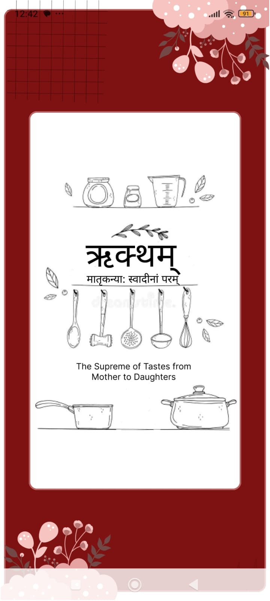
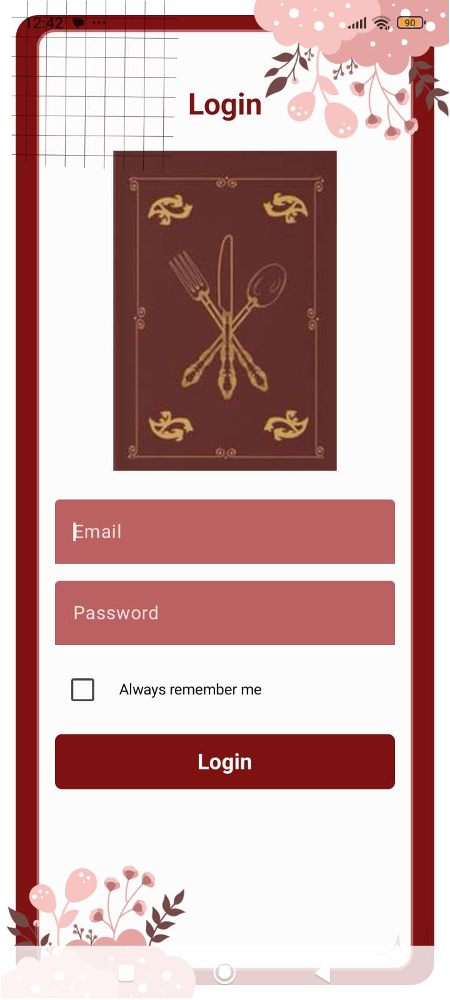
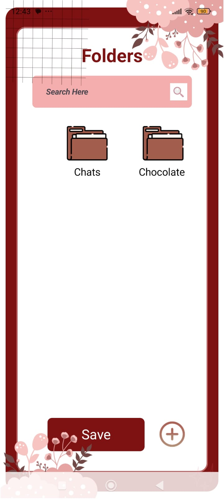

# ऋक्थम् -मातृकन्या: स्वादीनां परम्
# The supreme of tastes, from mother to daughters.

ऋक्थम् is an Android app built with Kotlin and Jetpack Compose that helps users organize recipes into folders and access them quickly with a clean, minimal UI. 🧑‍🍳


## Features ✨

- Email/password authentication using Firebase Authentication 🔐  
- Per‑user data stored in Firebase Realtime Database (`users/{uid}/folders/...`) ☁️  
- Folder-based organization for recipes (create ➕, rename ✏️, delete 🗑️)  
- Search bar to quickly filter folders by name 🔍  
- Clean Jetpack Compose UI with custom theming and decorative graphics 🎨  

## Tech Stack 🧰

- **Language:** Kotlin 💻  
- **UI:** Jetpack Compose, Material 3 🧱  
- **Backend:** Firebase Authentication, Firebase Realtime Database 🔥  
- **Architecture:** Single‑activity, Compose Navigation 🧭  
- **Build system:** Gradle (Android Gradle Plugin) ⚙️  

## Getting Started 🚀

### Prerequisites ✅

- Android Studio Hedgehog or newer  
- Android device or emulator (API 24+) 📲  
- A Firebase project with:
  - Email/Password sign‑in enabled  
  - Realtime Database created and rules configured for authenticated users  

### Setup 🛠️

1. **Clone the repository**

    ```
    git clone https://github.com/AasthathecoderX/Recipe_Manager.git
    cd Recipe_Manager
    ```

2. **Configure Firebase**

- Create a Firebase project and add an Android app with your package name.  
- Download `google-services.json` and place it in `app/src/main/`.  
- In the Firebase console, create a Realtime Database and note its URL.  
- Ensure your database rules allow authenticated read/write for `users/{uid}` paths.

3. **Update database URL**
  ```
    FirebaseDatabase.getInstance(
"https://YOUR-PROJECT-ID-default-rtdb.asia-southeast1.firebasedatabase.app/"
)
   ```

4. **Sync and run**

- Open the project in Android Studio.  
- Sync Gradle and run the app on a device or emulator ▶️.

## Usage 👇

- **Sign up / login:**  
  First, create an account in the Firebase console by registering your email and setting a password for this app’s project (Authentication → Users → Add user). ✍️  
  Then use the same email and password to log in from the app. Optionally enable “Always remember me” to save credentials locally 💾.  


- **Manage folders:**  
- Tap the **+** button to create a new folder ➕.  
- Use the **search bar** to filter folders by name in real time 🔎.  
- **Single tap** a folder to open its recipes 📂.  
- **Double tap** a folder name to rename it ✏️, then press **Save**.  
- **Long press** a folder to reveal the delete icon and tap it to remove the folder 🗑️.

## Project Structure 🗂️

- `app/src/main/java/com/example/recipe_manager/`
- `Login.kt` – authentication screen 🔑  
- `Folders.kt` – folders grid, search, rename, delete 📁  
- `FolderContent.kt` – list of recipes inside a folder 🍲  
- `util/PreferencesHelper.kt` – “remember me” credential storage 💡  

## Screenshots 📸





